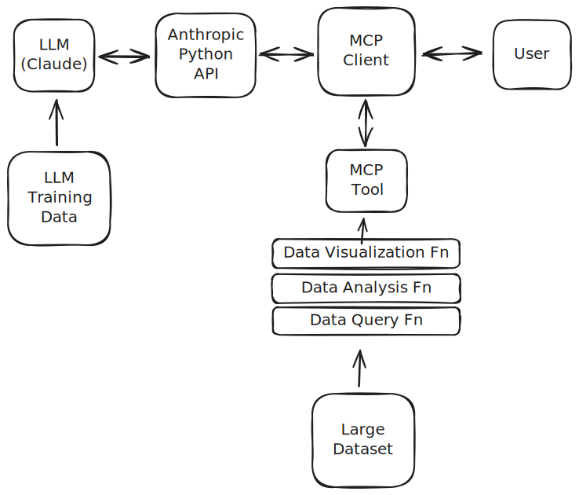

# claude-mcp-historical-weather
Demonstration of how to use Model Context Protocol (MCP) to connect Claude with historical weather data

## Video Demonstrating the Tutorial

[](https://www.youtube.com/watch?v=iR_9Tk1elyY)

https://www.youtube.com/watch?v=iR_9Tk1elyY

## Quick overview of what the demo does and why it's compelling

This notebook demonstrates how to use an MCP tool to allow Claude to access, analyze, and chart historical weather data. 

> "Everybody Talks About the Weather, But Nobody Does Anything About It"

The demo is compelling for a wide range of people because it deals with a relatable topic that everyone has experience with. With a simple modification to a Claude query, users can explore data from locations they are familiar with.

## Setup and Running Instructions

The demo is a Jupyter notebook that can be run in two ways:

### Option 1: Google Colab (Recommended for beginners)
<a target="_blank" href="https://colab.research.google.com/github/tylere/claude-mcp-historical-weather/blob/main/demo.ipynb">
  
</a>

- No setup required - runs entirely in your browser
- Automatically installs all dependencies
- Requires an Anthropic API key

### Option 2: Local Development
1. Clone the repository:
   ```bash
   git clone https://github.com/tylere/claude-mcp-historical-weather.git
   cd claude-mcp-historical-weather
   ```
2. Install dependencies using `uv`:
   ```bash
   uv sync
   ```
3. Set your Anthropic API key as an environment variable:
   ```bash
   export ANTHROPIC_API_KEY=your_api_key_here
   ```
4. Start VS Code:
   ```bash
   code .
   ```
5. Open the notebook `demo.ipynb` and click "Run All"


## Technical approach and key architectural decisions

In order to make this demo run in Google Colab, the entire demo is contained in a single file.

**Technical Approach:**
- Develop Python classes and functions for retrieving, aggregating, and plotting weather data (this code does not involve the Anthropic API or MCP)
- Create an MCP Client class that:
  - Registers tools to provide access to the Python classes/functions
  - Chats with a Claude model using the registered tools
- Demonstrate the MCP client integration for a series of weather queries




**Key Technology Choices:**
- Use the [Open-Meteo](https://open-meteo.com/) API for access to historical weather data
  - Use [caching](https://requests-cache.readthedocs.io/) to be kind to the free external API
- Use [Vega/Altair](https://altair-viz.github.io/) for creating charts (which I like for exploratory data analysis)
- Use [Pydantic](https://docs.pydantic.dev/) for data validation
- Use [pandas](https://pandas.pydata.org/) for time series analysis
- Add an option for displaying additional information (`verbose == True`) to help with debugging issues.

## Why you chose this particular demonstration

There exist large corpuses of highly relevant data that are not easily accessible on the internet, but rather are "hidden" behind APIs. Relatively few people know how to access these datasets, but by demonstrating how MCP tools work, I hope to inspire developers to build MCP servers that expand access to these datasets.

While there are many such "hidden" datasets, I chose historical weather/climate data because I am familiar with that domain, and it is easy for most people to relate to.

## How this helps developers understand Claude's potential

This demonstration shows how Claude's native ability to respond to data analysis questions can be significantly enhanced by building tools to access data APIs.

## What would make other builders want to learn more

- Clear examples that can be easily modified to provide results for areas that they are personally familiar with.
- Links to further explore concepts that are demonstrated, but are not fully explained.
- Suggestions for future directions to explore.

## How you used Claude in creating this demo (prompts, iterations, insights)

I used Claude in a variety of ways:
- Within the VS Code extension, asking Claude Code to draft sections of functionality
  - Example: "Create an MCPClient class that can be used as an MCP client within a Jupyter notebook"
- With research while writing the explanatory text for the notebook (via Claude Desktop).

## What you would add or improve given more time 

- Determine how to support queries that use units that are different than the underlying data. Currently, sunshine duration has to be specified in seconds, rather than the more natural unit of hours.
- Add some additional climate indices (monthly averages, growing degree days, consecutive hot days, etc)
- Demonstrate other MCP primitives (resources, prompts) to enhance the tool use.
- Add some flowchart diagrams (Mermaid?) to the notebook to make it clearer how all the components fit together, and how the messages/data flow between components.
- Re-record the video to make it shorter. Add sections to make the tool implementation progression easier to understand. 
- Separate the MCP Server logic into a stand-only server that can be run outside the notebook, so that other MCP clients can be used to access the functionality. (but that would probably be a separate tutorial/demo)


# Claude Use

## Development Workflows

**Primary Development Environment:**
- I primarily use Claude via Claude Code within VSCode/Cursor
- Even when developing content for Google Colab, I prefer using a VSCode environment because of its superior git and diff tools
- I use Claude Code's plan mode, then manually approve the changes

**Research Process:**
- For research tasks (ex: dataset sizes, Redwood City history, etc.) I use Claude Desktop
- Then cut and paste the research results into the notebook

## Example Prompts

### Initial Prompt (to establish the notebook sections)

> Create a Jupyter notebook (`index.ipynb`) that allows users to compare annual weather statistics for two locations. The notebook should work both when using Colab or when using a local jupyter server.
> - Notebook sections
>   - Overview
>   - Setup
>     - Environment Setup - Set up the Jupyter environment with the necessary dependencies so that it will run within Google Colab.
>     - Python Package Imports
>     - Anthropic API Key - define a helper function that retrieves a user's Anthropic API key. Order of preference for retrieval:
>       - API key stored as an environment variable
>       - API key stored as a Colab secret
>       - prompts the user to enter their key in a safe manner that doesn't store the key in the notebook.
>   - Motivation - Do we actually need to extend LLMs? Let's try a simple weather comparison query comparing two locations, **without specifying any tools** that could be used to answer the query.
>     - Include code to demonstrate this.
>   - Analysis
>     - (placeholder)
>   - MCP
>     - (placeholder)
>   - Chat Examples
>     - (placeholder)
>   - Summary
>     - (placeholder)

### Functionality Development Prompts

**Environment Setup:**
> Create a code cell that automatically detects your environment and installs the necessary dependencies for Google Colab.

**MCP Integration:**
> Create an MCPClient class that can be used as an MCP client within a Jupyter notebook.

**Feature Enhancement:**
> Update compare_locations_mcp so that it takes a list of one or more locations.

### Content Polish Prompts

**Content Improvement:**
> improve the content in the ## Overview section

**Style Enhancement:**
> Make minor improvements to the markdown cells throughout the notebook